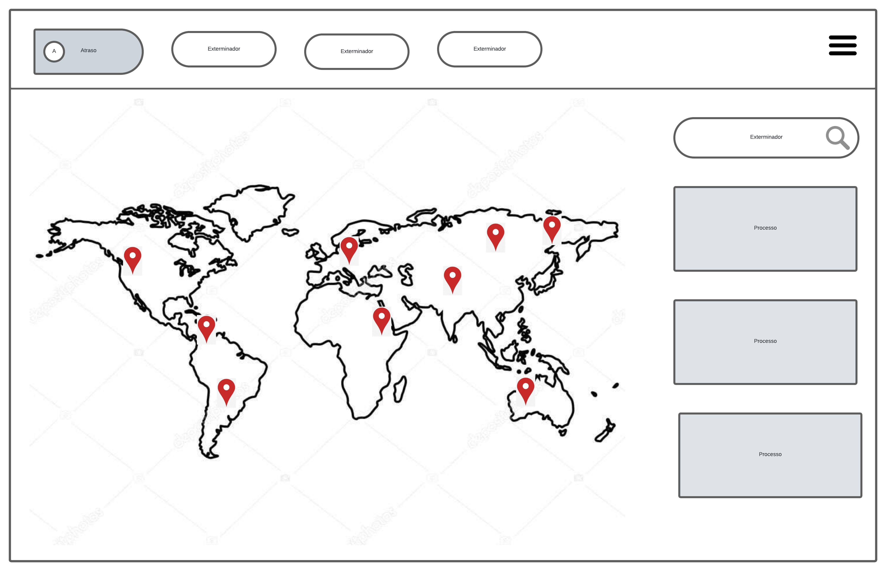

# WebMapSite

This project consist in a Web Map to display and interect with especific spacial reference points.

### Technologies

|   | |
| ------------- | ------------- |
|   | .NET Core  |
| | C#
|  | JavaScript |
| | PostgresSQL and PostGIS

### Initial Project WireFrame
